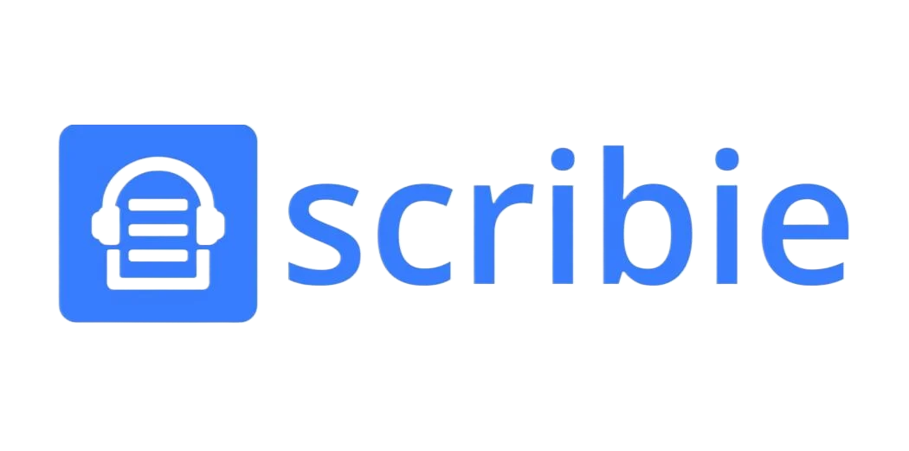

  

# Scribie.recorder.app

A mobile, voice recording, application developed as part of an internship for  <a href="https://scribie.com/" target="_blank">Scribie</a>, using the **Ionic (and Capacitor)** framework along with **Angular**.

It uses **HTML** and **scss** for the front end, while the logic governing app functionality is written in **Typescript**

## Table Of Contents
* Features
* Technologies and Assets

## Features

Feauture | Description
--- | --- |
Recording |  `Inbuilt voice recording` using the <a href="https://www.npmjs.com/package/capacitor-voice-recorder" target="_blank">Capacitor Voice Recording</a> package. |
Playback | `Playback` and `waveforms` using <a href="https://wavesurfer-js.org/" target="_blank">Wavesurfer</a> |
Storage and Transcription | `Local storage` of all recordings, along with basic information, and instructions for the `Transcription` of mentioned recordings |

All these features are complimented by appropriate **animations**, **responsive UI** and **SFX** to create a **satisfying** and **fulfilling user experience**.

## Technologies and Assets

* **Angular 15**
* **Ionic 6** and **Capacitor 5**
* <a href="https://www.npmjs.com/package/capacitor-voice-recorder" target="_blank">Capacitor Voice Recording</a>
* <a href="https://wavesurfer-js.org/" target="_blank">Wavesurfer</a>
* <a href="https://www.npmjs.com/package/@capacitor/browser" target="_blank">Capacitor Browser</a>
* <a href="https://www.npmjs.com/package/@capacitor-community/native-audio" target="_blank">Capacitor Native Audio</a>

### Audio Files

All Audio Files used in the app have been downloaded from <a href="https://pixabay.com/sound-effects/" target="_blank">Pixabay</a> in accordance with their policy. Files may be slighlty altered when compared to their originals.

### Front UI

This project does use elements from the <a href="https://htmlstream.com/preview/front-v3.3/documentation/index.html" target="_blank">Front Bootstrap Template</a>.

Credit: 
Sound | File
--- | --- |
Error | `Error 2` by UNIVERSFIELD |
Save | `decide.mp3` by Pixabay |
Click | `Interface (Trial)` by UNIVERSFIELD |
Discard | `patear tacho de basura` by Pixabay |
Toggle Recording | `Notifications` Sound by SoundsForYou |
